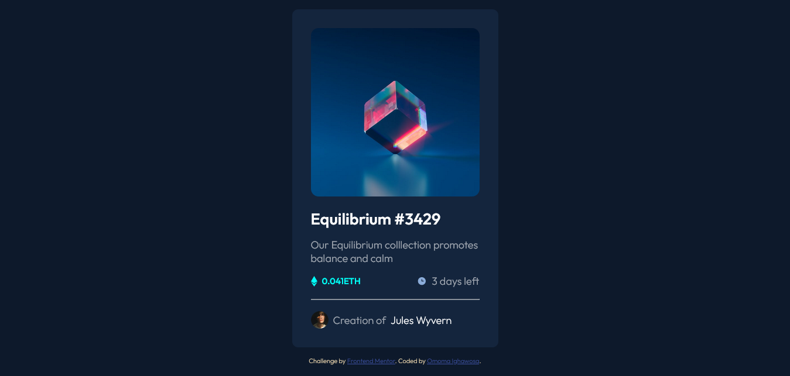

# Frontend Mentor - NFT preview card component solution

This is a solution to the [NFT preview card component challenge on Frontend Mentor](https://www.frontendmentor.io/challenges/nft-preview-card-component-SbdUL_w0U). Frontend Mentor challenges help you improve your coding skills by building realistic projects.

## Table of contents

-   [Overview](#overview)
    -   [The challenge](#the-challenge)
    -   [Screenshot](#screenshot)
    -   [Links](#links)
-   [My process](#my-process)
    -   [Built with](#built-with)
    -   [What I learned](#what-i-learned)
    -   [Continued development](#continued-development)
    -   [Useful resources](#useful-resources)
-   [Author](#author)

## Overview

In the NFT Preview Card Component challenge by Frontend Mentor, the task was to create a responsive and visually appealing preview card for an NFT artwork. The challenge required designing and coding a card that showcased the artwork along with relevant information like title, description, price, and creator details.

I successfully completed the challenge by enhancing the provided HTML structure with CSS styling. I focused on details such as hover effects, typography, color scheme, and alignment to create a polished and professional-looking card. Additionally, I ensured that the card was responsive, adapting well to different screen sizes and orientations.

I utilized various CSS properties, selectors, and techniques to achieve the desired visual appearance and maintained a clean and organized code structure. I also paid attention to accessibility by providing alternative text for images.

I thoroughly enjoyed working on this challenge and honing my CSS skills while creating an engaging NFT preview card. I'm excited to showcase my completed solution and demonstrate my creativity and problem-solving abilities.

### The challenge

Users should be able to:

-   View the optimal layout depending on their device's screen size
-   See hover states for interactive elements

### Screenshot



### Links

-   Solution URL: [Add solution URL here](https://your-solution-url.com)
-   Live Site URL: [Add live site URL here](https://your-live-site-url.com)

## My process

During the development of the NFT preview card component, I followed a systematic and iterative process to ensure a smooth and efficient workflow. Here's a summary of the steps I took:

1. Understanding the Requirements: I carefully reviewed the challenge requirements and specifications to gain a clear understanding of what was expected. I paid attention to the layout, design elements, and functionality required for the NFT preview card.

2. Planning and Wireframing: Before diving into the code, I spent some time planning the overall structure and layout of the card. I created a wireframe or sketched a rough representation to visualize the component's design and elements.

3. HTML Structure: Based on the wireframe, I created the HTML structure for the NFT preview card. I ensured that the markup was semantically meaningful and properly organized, using appropriate HTML elements and attributes.

4. Styling with CSS: Using CSS, I applied styles to the HTML elements to achieve the desired visual appearance. I focused on typography, colors, spacing, and alignment to create an aesthetically pleasing and responsive design. I made use of CSS techniques such as flexbox, grid, and transitions to enhance the layout and interactivity of the card.

5. Testing and Refinement: Throughout the development process, I regularly tested the component on different devices and browsers to ensure a consistent and responsive experience. I made necessary adjustments and refinements based on the test results, addressing any issues related to layout, responsiveness, or functionality.

6. Optimization and Performance: I optimized the code for performance by minimizing file sizes, optimizing images, and using appropriate techniques such as lazy loading. I also ensured that the component followed best practices for web accessibility, including proper use of alt text for images and semantic HTML.

7. Documentation: As I progressed, I maintained clear and concise documentation of my code, making it easy to understand and navigate for future reference. I added comments where necessary to explain complex or important parts of the code.

By following this process, I was able to create a well-structured, visually appealing, and responsive NFT preview card component that meets the challenge requirements. I'm proud of the result and look forward to showcasing my work.

### Built with

-   Semantic HTML5 markup
-   CSS custom properties
-   Flexbox
-   Mobile-first workflow

### What I learned

During the development of the NFT preview card component, I gained valuable insights and learned the following key concepts:

1. CSS pseudo-elements: I utilized the ::before pseudo-element to create an overlay effect on the figure element, resulting in a visually appealing hover effect.

2. Positioning and overlapping: I used position: absolute to precisely position elements and overlay a colored layer on top of the figure element when hovered.

3. Creating overlay effects: By adjusting properties such as width, height, border-radius, and opacity, I achieved a desirable overlay effect on the figure element.

4. Transitions and hover effects: I applied CSS transitions to smoothly animate the hover effect, resulting in a subtle and visually pleasing transition.

These concepts enhanced the interactivity and visual appeal of the NFT preview card component and expanded my CSS skills for future projects.

```css
figure:hover::before {
    content: "";
    position: absolute;
    top: 0;
    left: 0;
    width: 100%;
    height: 99%;
    border-radius: 10px;
    background-color: hsl(178, 100%, 50%);
    opacity: 0.6;
}
```

### Continued development

In the future, I plan to focus on the following areas to further enhance the NFT preview card component:

1. Refining Responsive Design: I aim to fine-tune the card's responsiveness across various screen sizes and resolutions for a seamless user experience.

2. Improving Accessibility: I will work on enhancing accessibility features to ensure the component is more inclusive and user-friendly, including keyboard navigation and screen reader compatibility.

3. Browser Compatibility: I intend to conduct further testing to ensure consistent performance across different browsers and address any compatibility issues that may arise.

4. Code Optimization: I will review and refactor the codebase to improve efficiency, readability, and maintainability, eliminating any unused styles and optimizing CSS selectors.

5. Adding Interactivity: I plan to incorporate more interactive elements, animations, and social sharing options to increase user engagement with the NFT preview card.

### Useful resources

-   [Google Fonts](https://fonts.google.com/specimen/Outfit) -I utilized Google Fonts to access and integrate the "Outfit" font family into the project. Google Fonts offers a wide selection of fonts that can enhance the visual appeal of web designs.
-   [Frontend Mentor](https://www.frontendmentor.io/) - The challenge prompt and design files provided by Frontend Mentor served as the foundation for this project. They provided a clear direction and helped me understand the requirements.

## Author

-   Website - [Omoma Ighawosa](https://ig-matrix.github.io/Lesson_3_Task_6_Omoma_Ighawosa/)
-   Frontend Mentor - [@Ig-Matrix](https://www.frontendmentor.io/profile/Ig-Matrix)
-   Twitter - [@I_am_ig_matrix](https://twitter.com/i_am_Ig_matrix)
